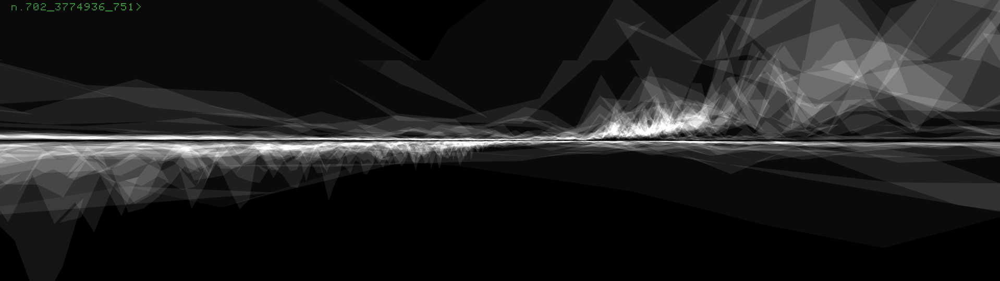

# Código creativo 2. Programación estructurada en el diseño

Al finalizar el curso el alumno: Aplicará conocimientos de programación estructurada en Processing para realizar ejercicios básicos de diseño y lenguaje visual 2D.   
Reconocer el contexto de la programación (no) creativa y de la generación de imágenes en relación a herramientas de inteligencia artificial. 

## Sesiones

- [x] 09.08.23 - [Sesión 01 - Introducción a Processing](docs/s01.md) 
- [x] 16.08.23 - [Sesión 02 - Fundamentos. Primitivos 2D y color](docs/s02.md) 
- [x] 23.08.23 - [Sesion 03 - Modo dinámico](docs/s03.md)
- [x] 30.08.23 - [Sesión 04 - Random y Variables](https://gist.github.com/MarianneTeixido/e210154480b70a71d88996dcb8501b16)
- [x] 06.09.23 - [Sesión 05 - Condicionales. If()](https://gist.github.com/MarianneTeixido/18ab0cf2435314335a7f6fd59a21293b) 
- [x] 13.09.23 - [Sesión 06 - Repaso Condicionales e introducción a PImage](https://gist.github.com/MarianneTeixido/50dbb3b76d65ea4586e02ae8935c6b42) 
- [x] 20.09.23 - [Sesión 07 - Collage. PImage y condicionales](https://gist.github.com/MarianneTeixido/43830707e609eb25cfccfef4fc883493) 
- [X] 27.09.23 -  [Sesión 08 - Puntillismo. Uso de imágenes con la función get()](https://gist.github.com/MarianneTeixido/342a857399d617b9769c4f0f303168d4)
- [ ] 11.10.23 - [Sesión 09 - Repaso condicionales e imágenes. Introducción Arreglos](docs/s09.md)

## Recursos 

- [Processing](https://processing.org/)
- [ChatGPT](https://chat.openai.com/)
- [Sistema de Cordenadas](https://processing.org/tutorials/coordinatesystemandshapes)
- [Variables](https://processing.org/examples/variables.html)
- [Random](https://processing.org/reference/random_.html)
- [Setup y draw](https://processing.org/examples/setupdraw.html)
- [if](https://processing.org/reference/if.html)
- [else](https://processing.org/reference/else.html)
- [PImage](https://processing.org/reference/PImage.html)
- [Arreglos](https://processing.org/reference/Array.html)

## Recursos adicionales

- [The Coding Train](https://www.youtube.com/@TheCodingTrain/playlists)
- [Collage + code de Ana Carreras](https://www.annacarreras.com/collage-generatiu/)
- [Daily art de Saskia Freeke](https://sasj.nl/portfolio/)
  
- [Descargar imágenes en PNG](https://www.pngwing.com/es)
- [Pexels](https://www.pexels.com/es-es/)
- [Crear paletas de color](https://color.adobe.com/es/create/color-wheel)
- [Eliminar fondo de una imagen](https://www.remove.bg/es)

## Criterios de evaluación

- Realización de ejercicios parciales sobre lógica condicional (30%)
- Realización de ejercicios parciales sobre loops y funciones (30%)
- Desarrollo de 5 diseños que puedan evidenciar el uso de: condicionales, bucles, funciones aleatorias para el diseño y lenguaje visual 2D (40%) 

## Referencias

- Codina, Ll. (2023) [Cómo utilizar ChatGPT en el aula con perspectiva ética y pensamiento crítico: una proposición para docentes y educadores](https://www.lluiscodina.com/chatgpt-educadores/)
- Choi, T. (2017) [Hello World](http://avant.org/project/hello-world/)
- Choi, T. (2017) [Zero and One](http://avant.org/project/zero-one/)
- Felguérez, M y Sasson, M. (1983) La Máquina Estética. Universidad Nacional Autónoma de México. 
- Goldsmith, K. (2011) Uncreative Writing: Managing Language in the Digital Age. Columbia University Press.
- Reas, C. and Fry, B. (2014) Processing: A Programming Handbook for Visual Designers and Artists. The MIT Press.
- Stieg, C. (2023) [ChatGPT vs. Me: Can an AI Chatbot Build a Program From Scratch Better Than a Human?](https://www.codecademy.com/resources/blog/chatgpt-vs-human-developer-coding-project/)
